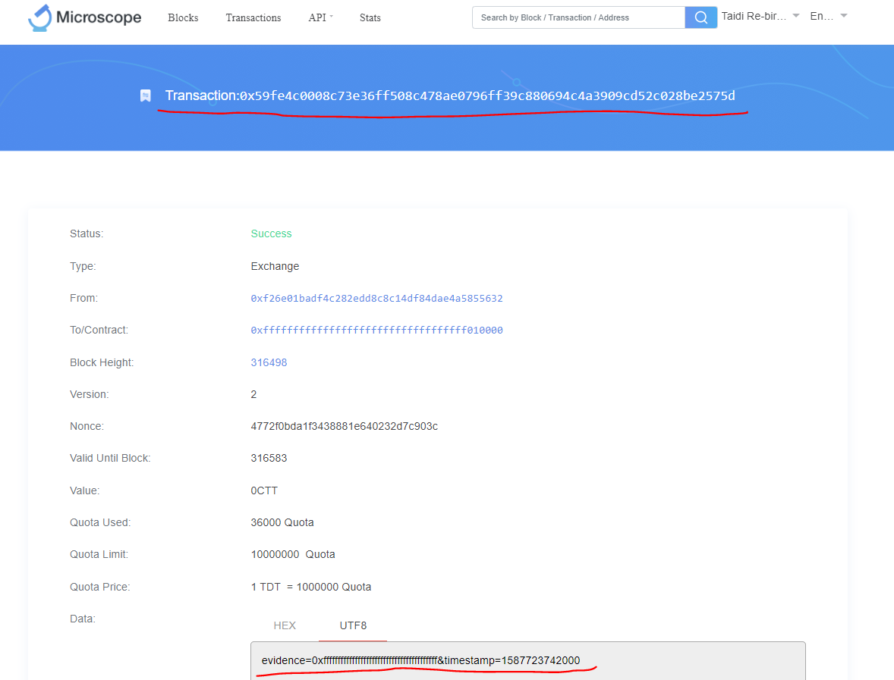

# middleware_hn

## `Contents`
- [middleware_hn](#middlewarehn)
  - [`Contents`](#contents)
  - [环境](#%e7%8e%af%e5%a2%83)
  - [步骤](#%e6%ad%a5%e9%aa%a4)
    - [1. 环境搭建](#1-%e7%8e%af%e5%a2%83%e6%90%ad%e5%bb%ba)
    - [2. 拉取代码](#2-%e6%8b%89%e5%8f%96%e4%bb%a3%e7%a0%81)
    - [3. 修改配置文件 .env](#3-%e4%bf%ae%e6%94%b9%e9%85%8d%e7%bd%ae%e6%96%87%e4%bb%b6-env)
    - [4. 新建数据库 middleware-server](#4-%e6%96%b0%e5%bb%ba%e6%95%b0%e6%8d%ae%e5%ba%93-middleware-server)
    - [5. 然后运行：](#5-%e7%84%b6%e5%90%8e%e8%bf%90%e8%a1%8c)
  - [访问示例](#%e8%ae%bf%e9%97%ae%e7%a4%ba%e4%be%8b)
    - [1. 注册](#1-%e6%b3%a8%e5%86%8c)
    - [2. 假设数据](#2-%e5%81%87%e8%ae%be%e6%95%b0%e6%8d%ae)
    - [3. 生成签名](#3-%e7%94%9f%e6%88%90%e7%ad%be%e5%90%8d)
    - [4. 数据上链](#4-%e6%95%b0%e6%8d%ae%e4%b8%8a%e9%93%be)
    - [5. 查询存证哈希](#5-%e6%9f%a5%e8%af%a2%e5%ad%98%e8%af%81%e5%93%88%e5%b8%8c)
  - [性能瓶颈与改进](#%e6%80%a7%e8%83%bd%e7%93%b6%e9%a2%88%e4%b8%8e%e6%94%b9%e8%bf%9b)


## 环境
* rust 环境
* Postgres 环境，数据库
* Diesel 环境，管理数据库

环境安装参考：[Rust Actix-Web 验证 Auth Web 微服务](https://github.com/flyq/blogs/blob/master/Rust%20%E5%AD%A6%E4%B9%A0/token%20%E8%AE%A4%E8%AF%81/README.md)。
主要参考以下两个，上面那个文档有点乱，看的时候注意体会。。。
* 安装 postgres
* 安装 diesel-cli


## 步骤
### 1. 环境搭建
按照[环境](#%e7%8e%af%e5%a2%83)把环境配置好，在postgres里面生成数据库USER。

### 2. 拉取代码
```shell
git clone https://github.com/snzhub/middleware_hn.git
```
### 3. 修改配置文件 .env
注意新建 .env 文件并且设置：
```.env
DATABASE_URL=postgres://<database user>:<database user's password>@localhost/<database name>
SPARKPOST_API_KEY='<mail's KEY>'
SENDING_EMAIL_ADDRESS='<mail's address>'
```

### 4. 新建数据库 middleware-server
```shell
$ diesel setup
Creating database: middleware-server
Running migration 2020-03-04-091801_users
Running migration 2020-03-04-091813_invitations
```
创建成功。

### 5. 然后运行：
```shell
cargo run test
```
服务就启动了。其中 test 是加/解密密这个文件夹下面 keystore（这里是 test.json） 的密码

## 访问示例
### 1. 注册
得到注册id：
```shell
$ curl --request POST   --url http://localhost:3000/v1/invitation   --header 'content-type: application/json'   --data '{"email":"flyqtest6@gmail.com"}'


# api return
{"id":"8549e720-2e64-4f91-b752-432cedfba2c2","email":"flyqtest11@gmail.com","expires_at":"2020-04-25T18:03:01.222692"}

```

使用注册id注册，账户以及密码的 **hash** 将保存到数据库：
```shell
$ curl --request POST  --url http://localhost:3000/v1/register/363955bb-9916-4196-a6ac-cad898c98c29  --header 'content-type: application/json'  --data '{"password":"flyqtestpw"}'


# api return
{"email":"flyqtest11@gmail.com"}
```

### 2. 假设数据

假设我们要上链的存证哈希，即 evidence 为 `0xffffffffffffffffffffffffffffffffffffffff` ，时间戳为 `1587723742000`，

### 3. 生成签名
生成签名规则是：
```shell
payload = "evidence=0xffffffffffffffffffffffffffffffffffffffff&timestamp=1587723742000"
signature = hmacsha256hash(secretKey, payload)
```

使用 https://github.com/snzhub/hmac_sig 这个工具
比如使用 密码： flyqtestpw 对 evidence 为 0xffffffffffffffffffffffffffffffffffffffff ，timestamp 为 1587723742000 的数据签名：
```shell 
cargo run flyqtestpw 0xffffffffffffffffffffffffffffffffffffffff 1587723742000 0
```
其中命令里面最后一个 0 代表是生成上传数据的签名，如果是 1，将代表生成查询数据的签名

最后得到签名：
```shell
 $ cargo run flyqtestpw 0xffffffffffffffffffffffffffffffffffffffff 1587723742000 0
    Finished dev [unoptimized + debuginfo] target(s) in 0.05s
     Running `target/debug/hmac_sig flyqtestpw 0xffffffffffffffffffffffffffffffffffffffff 1587723742000 0`
sig: "e379789b267b379ef71b467bf79e71bd0880abb34edab2f35a29e49882973cae"
```
### 4. 数据上链
发起交易示例：
```shell
curl --request POST --url http://localhost:3000/v1/evidence/upload  --header 'content-type: application/json'  --data '{"email": "flyqtest11@gmail.com","evidence":"0xffffffffffffffffffffffffffffffffffffffff", "timestamp": 1587723742000, "signature": "e379789b267b379ef71b467bf79e71bd0880abb34edab2f35a29e49882973cae"}'


# api return
{"rescode":1,"resmsg":"Success","data":{"txid":"0x59fe4c0008c73e36ff508c478ae0796ff39c880694c4a3909cd52c028be2575d"}}
```
注意 evidence, timestamp, signature 需要输入正确的字段。和上面生成的一一对应。

查询交易:



注意返回的 Json 数据中，txid 和浏览器里面的是相同的。并且上链的 payload 也是对的上的。


### 5. 查询存证哈希
查询交易时，也需要签名：
使用 https://gitlab.ethgeek.cn/flyq/hmac_sig 这个工具
比如使用 密码： flyqtestpw 对 txid 为 0x59fe4c0008c73e36ff508c478ae0796ff39c880694c4a3909cd52c028be2575d，timestamp 为 1587723742000 的数据签名：
```shell
cargo run flyqtestpw 0x59fe4c0008c73e36ff508c478ae0796ff39c880694c4a3909cd52c028be2575d 1587723742000 1
```
其中命令里面最后一个 1，代表生成查询数据的签名

最后得到签名：
```shell
$ cargo run flyqtestpw 0x59fe4c0008c73e36ff508c478ae0796ff39c880694c4a3909cd52c028be2575d 1587723742000 1
    Finished dev [unoptimized + debuginfo] target(s) in 0.05s
     Running `target/debug/hmac_sig flyqtestpw 0x59fe4c0008c73e36ff508c478ae0796ff39c880694c4a3909cd52c028be2575d 1587723742000 1`
sig: "866be8dced49640d0ecf789485bebb304a62c713d61a156ee95d55861029eb4b"

```
根据得到的签名，发起存证查询：
```shell
$ curl --request GET --url http://localhost:3000/v1/evidence/query  --header 'content-type: application/json'  --data '{"email": "flyqtest11@gmail.com","txid":"0x59fe4c0008c73e36ff508c478ae0796ff39c880694c4a3909cd52c028be2575d", "timestamp": 1587723742000, "signature": "866be8dced49640d0ecf789485bebb304a62c713d61a156ee95d55861029eb4b"}'

# api 返回
{"rescode":1,"resmsg":"Success","data":{"evidence":"0xffffffffffffffffffffffffffffffffffffffff"}}
```

根据返回的 evidence，确实就是我们之前上传的evidence(存证哈希)。

整个流程结束。

## 性能瓶颈与改进

- [ ] 需要等待上链结果，并得到交易Hash返回给API。需要3秒左右。改进：本地自己算交易hash，异步得到上链结果后，再确定。工作量：中等。
- [ ] 调用 cita-cli 程序，本身它就是一个瓶颈，而且 cita-cli 上链时需要每次从链上拿一些数据，比如当前块高之类的。后续准备参考 cita-cli 里面的模块以及 Rust SDK 直接把上链代码内置进来。工作量：高。
- [ ] hmac 签名过程 [hmac_sig](https://gitlab.ethgeek.cn/flyq/hmac_sig) 有明显的停顿感。改进：目前用的hmac库可以为了安全性实现得比较复杂，但是自己直接把key，msg拼接hash感觉不是很安全。工作量：中等。
- [ ] KMS 的位置改进。每次Post都需要解密一次Keystore，可以设置为系统启动时就解密好。工作量：低。
